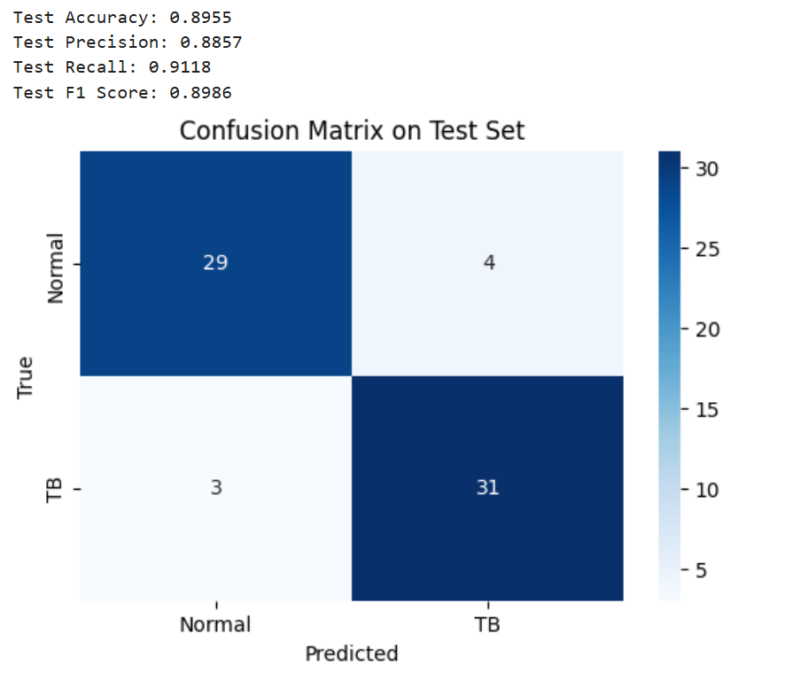

# TB Detection Using HybridEfficientNet on Shenzhen Dataset

## Overview

This project implements a deep learning model for tuberculosis (TB) detection using chest X-ray images from the Shenzhen dataset. The model, named `HybridEfficientNet`, leverages two branches of the EfficientNet-B4 architecture to process images enhanced with Unsharp Masking (UM) and High-frequency Emphasis Filtering (HEF). The features from both branches are fused and used for binary classification (normal vs. TB).

The project includes preprocessing, model definition, training, and testing phases, with a focus on achieving high recall to minimize false negatives in TB detection. The best model achieved the following test performance:

- **Test Accuracy**: 0.8955
- **Test Precision**: 0.8857
- **Test Recall**: 0.9118
- **Test F1 Score**: 0.8986

## Dataset

The Shenzhen dataset contains 662 chest X-ray images, with 326 normal cases and 336 TB cases. The dataset is split into training (70%), validation (20%), and test (10%) sets. The images are preprocessed with UM and HEF enhancements to improve feature extraction.

- **Source**: The dataset is available from the [National Library of Medicine](https://lhncbc.nlm.nih.gov/publication/pub9931) or other public repositories.
- **Directory Structure**:
  ```
  datasets/shenzhen/
  ├── images/              # Contains the X-ray images (e.g., CHNCXR_0001_0.png)
  └── shenzhen_metadata.csv # Metadata file with study IDs and labels
  ```

## Model Architecture

The `HybridEfficientNet` model uses two EfficientNet-B4 branches:
- One branch processes UM-enhanced images.
- The other branch processes HEF-enhanced images.
- Features from both branches are concatenated, fused using a 1x1 convolution, and passed through a global average pooling layer, dropout (rate=0.7), and a final fully connected layer for binary classification.

Key features of the model:
- **Dropout**: 0.7 to reduce overfitting.
- **Frozen Layers**: The first 4 blocks of each EfficientNet-B4 branch are frozen to prevent overfitting and speed up training.
- **Data Augmentation**: Random horizontal flips, rotations (±10 degrees), and brightness/contrast adjustments.

## Requirements

To run this project, you’ll need the following dependencies:

- Python 3.8+
- PyTorch
- Torchvision
- Torchmetrics
- OpenCV (`cv2`)
- NumPy
- Pandas
- Matplotlib
- Seaborn

You can install the dependencies using the following command:

```bash
pip install torch torchvision torchmetrics opencv-python numpy pandas matplotlib seaborn
```

Alternatively, you can create a Conda environment (as used in the project):

```bash
conda create -n Tuberculosis python=3.8
conda activate Tuberculosis
conda install pytorch torchvision torchaudio cudatoolkit=11.3 -c pytorch
conda install opencv numpy pandas matplotlib seaborn
pip install torchmetrics
```

## Project Structure

```
tb_detection/
├── datasets/
│   └── shenzhen/
│       ├── images/
│       └── shenzhen_metadata.csv
├── outputs/
│   ├── hybrid_efficientnet_epoch_*.pth  # Model checkpoints for each epoch
│   └── hybrid_efficientnet_best.pth     # Best model based on validation F1 score
├── code.ipynb                           # Jupyter Notebook with all code
└── README.md                            # This file
```

## Usage

### 1. Clone the Repository

```bash
git clone https://github.com/your-username/tb-detection-hybrid-efficientnet.git
cd tb-detection-hybrid-efficientnet
```

### 2. Prepare the Dataset

- Download the Shenzhen dataset and place the images in `datasets/shenzhen/images/`.
- Ensure the `shenzhen_metadata.csv` file is in `datasets/shenzhen/`.
- Update the paths in the code if your dataset is located elsewhere:
  ```python
  image_dir = r"path/to/your/shenzhen/images"
  metadata_file = r"path/to/your/shenzhen_metadata.csv"
  ```

### 3. Run the Code

The code is provided in a Jupyter Notebook (`code.ipynb`). You can run it in the following order:

#### Cell 1: Preprocessing
- Loads the dataset, applies UM and HEF enhancements, and creates `DataLoader` objects for training, validation, and testing.
- Includes data augmentation for the training set (random flips, rotations, brightness/contrast adjustments).

#### Cell 2: Model Definition
- Defines the `HybridEfficientNet` class and instantiates the model.
- Moves the model to the GPU (if available).

#### Cell 3: Training
- Trains the model for 10 epochs with early stopping (patience=5).
- Uses a learning rate of 0.0001, class weights in the loss function, gradient clipping, and a learning rate scheduler (`ReduceLROnPlateau`).
- Saves model checkpoints after each epoch and the best model based on validation F1 score.

#### Cell 4: Testing
- Evaluates the best model on the test set.
- Computes accuracy, precision, recall, F1 score, and displays a confusion matrix.

To run the notebook:

```bash
jupyter notebook code.ipynb
```

Alternatively, you can convert the notebook to a Python script and run it:

```bash
jupyter nbconvert --to script code.ipynb
python code.py
```

### 4. Results

The best model achieved the following performance on the test set:

  

The confusion matrix (generated during testing) provides a detailed breakdown of true positives, true negatives, false positives, and false negatives.

## Training Details

- **Epochs**: 10 (with early stopping, stopped after 4 epochs in the initial run)
- **Learning Rate**: 0.0001
- **Optimizer**: Adam with weight decay (1e-3)
- **Loss Function**: CrossEntropyLoss with class weights to handle slight class imbalance
- **Regularization**:
  - Dropout: 0.7
  - Weight decay: 1e-3
  - Frozen layers: First 4 blocks of EfficientNet-B4
- **Data Augmentation**:
  - Random horizontal flips (p=0.5)
  - Random rotations (±10 degrees)
  - Brightness/contrast adjustments

## Future Improvements

- **Training Stability**: Implement learning rate warmup to stabilize early training and prevent drastic drops in validation performance.
- **Cross-Validation**: Perform k-fold cross-validation to get a more robust estimate of the model’s performance.
- **Threshold Adjustment**: Adjust the classification threshold to balance precision and recall based on clinical requirements.
- **More Data Augmentation**: Add vertical flips, random scaling, or Gaussian noise to improve robustness.
- **Ensemble Models**: Train multiple models and combine their predictions to improve performance.

## Contributing

Contributions are welcome! If you have ideas for improving the model, adding new features, or optimizing the code, feel free to open an issue or submit a pull request.

## License

This project is licensed under the MIT License. See the [LICENSE](LICENSE) file for details.

## Acknowledgments

- The Shenzhen dataset is provided by the National Library of Medicine.
- The EfficientNet architecture is based on the work by Tan and Le (2019).

---
